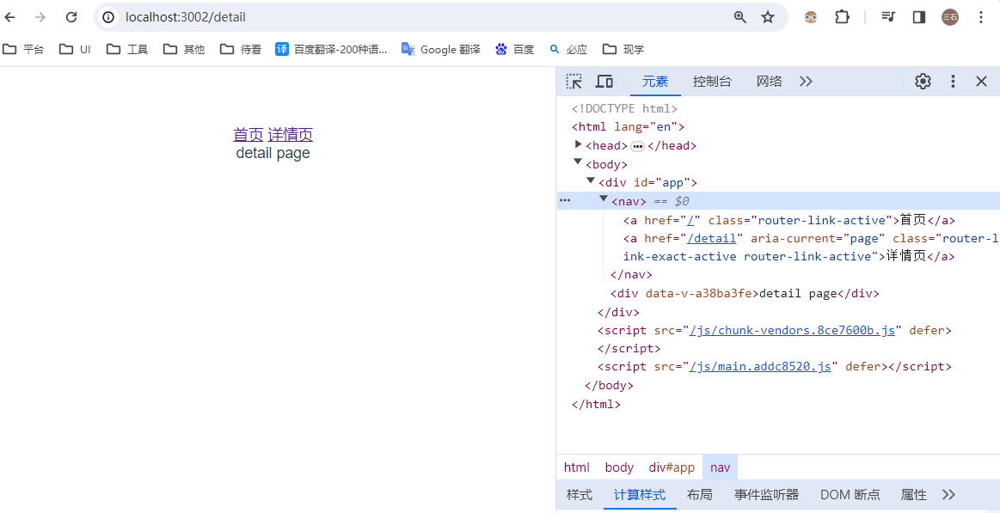

# vue2-ssr  with  vue-router

# enviroment 
```angular2html
window 10专业版
node : v18.18.1
npm : 9.8.1
yarn : 1.22.18
```
# refer
```angular2html
https://www.bilibili.com/video/BV1dE411C7f5/?spm_id_from=333.337.search-card.all.click&vd_source=bec3b674447bc519ccbb5aa43df63a75
```

## install package
```
yarn 
```

### Project startup
```
yarn build
yarn start
```


